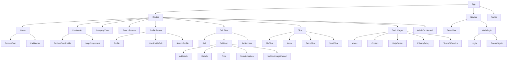
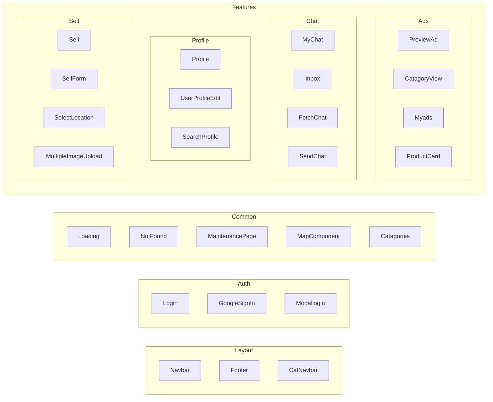

# Random OLX Clone

An OLX Clone built with the MERN Stack (MongoDB, Express.js, React, Node.js)

This project is a complete replica of the OLX website, featuring a real-time chat system, user authentication, and product listing capabilities.

🌐 **Live Demo:** [https://random.loophub.in/](https://random.loophub.in/)

---

## 📑 Table of Contents

- [Features](#-features)
- [Tech Stack](#-tech-stack)
- [Project Structure](#-project-structure)
- [React Component Tree](#-react-component-tree)
- [Database Models](#-database-models)
- [API Routes](#-api-routes)
- [Categories](#-categories)
- [Getting Started](#-getting-started)
  - [Prerequisites](#prerequisites)
  - [Installation](#installation)
  - [Environment Variables](#environment-variables)
- [Available Scripts](#-available-scripts)
- [Screenshots](#-screenshots)
- [Contributing](#-contributing)
- [License](#-license)

---

## ✨ Features

- 🔐 **User Authentication** - Email/Password & Google OAuth sign-in
- 📧 **Email Verification** - Secure account verification via Resend
- 📝 **Product Listings** - Create, view, and manage product ads
- 🖼️ **Image Upload** - Multiple image uploads via Cloudinary (up to 12 images)
- 💬 **Real-time Chat** - Direct messaging between buyers and sellers
- 🔍 **Search & Filter** - Search products by title, category, and location
- 👤 **User Profiles** - View and edit user profiles
- 📍 **Location Support** - Country, State, City selection for listings
- 🛡️ **Admin Dashboard** - Administrative controls for managing users and products
- 📱 **Responsive Design** - Works on desktop and mobile devices

---

## 🛠️ Tech Stack

### Frontend
| Technology | Version | Purpose |
|------------|---------|---------|
| React | 18.2.0 | UI Framework |
| React Router DOM | 6.11.1 | Client-side routing |
| Chakra UI | 2.6.1 | Component library |
| Bootstrap | 5.2.3 | CSS framework |
| Axios | 1.4.0 | HTTP client |
| Framer Motion | 10.12.14 | Animations |
| React Icons | 5.5.0 | Icon library |

### Backend
| Technology | Version | Purpose |
|------------|---------|---------|
| Node.js | ≥24.0.0 | Runtime |
| Express | 5.2.1 | Web framework |
| MongoDB/Mongoose | 9.0.0 | Database |
| Cloudinary | 2.8.0 | Image storage |
| JWT | 9.0.2 | Authentication |
| Bcrypt | 6.0.0 | Password hashing |
| Resend | 6.5.2 | Email service |

---

## 📁 Project Structure

```
Random-OLX-Clone/
├── client/                          # React frontend
│   ├── public/
│   │   ├── index.html
│   │   └── robots.txt
│   └── src/
│       ├── App.js                   # Main application component
│       ├── App.css                  # Global styles
│       ├── index.js                 # Entry point
│       ├── components/
│       │   ├── auth/                # Authentication components
│       │   │   ├── GoogleSignIn.js
│       │   │   ├── Login.js
│       │   │   └── Modallogin.js
│       │   ├── common/              # Shared/reusable components
│       │   │   ├── Catagories.js
│       │   │   ├── Loading.js
│       │   │   ├── MaintenancePage.js
│       │   │   ├── MapComponent.js
│       │   │   ├── NotFound.js
│       │   │   ├── NotListedAnything.js
│       │   │   └── SearchNotFound.js
│       │   └── layout/              # Layout components
│       │       ├── CatNavbar.js
│       │       ├── Footer.js
│       │       └── Navbar.js
│       ├── features/
│       │   ├── admin/               # Admin features
│       │   │   └── AdminDashboard.js
│       │   ├── ads/                 # Product/Ad features
│       │   │   ├── CatagoryView.js
│       │   │   ├── MyadCards.js
│       │   │   ├── Myads.js
│       │   │   ├── PreviewAd.js
│       │   │   └── ProductCards/
│       │   │       ├── ProductCard.js
│       │   │       └── ProductCardProfile.js
│       │   ├── chat/                # Chat features
│       │   │   ├── FetchChat.js
│       │   │   ├── Inbox.js
│       │   │   ├── MyChat.js
│       │   │   └── SendChat.js
│       │   ├── profile/             # User profile features
│       │   │   ├── Profile.js
│       │   │   ├── SearchProfile.js
│       │   │   └── UserProfileEdit.js
│       │   ├── search/              # Search features
│       │   │   ├── Searchbar.js
│       │   │   └── SearchResults.js
│       │   └── sell/                # Selling features
│       │       ├── Addetails.js
│       │       ├── AdSuccess.js
│       │       ├── Details.js
│       │       ├── multiple-image-upload.component.js
│       │       ├── Price.js
│       │       ├── SelectLocation.js
│       │       ├── Sell.js
│       │       └── SellForm.js
│       ├── pages/                   # Page components
│       │   ├── About.js
│       │   ├── Contact.js
│       │   ├── HelpCenter.js
│       │   ├── Home.js
│       │   ├── PrivacyPolicy.js
│       │   └── TermsOfService.js
│       └── utils/
│           └── imageUtils.js
│
├── server/                          # Express backend
│   ├── index.js                     # Server entry point
│   ├── package.json
│   ├── adminRoutes/
│   │   └── adminRoutes.js
│   ├── authRoutes/
│   │   ├── authRoutes.js
│   │   └── googleAuthRoutes.js
│   ├── chatRoutes/
│   │   └── chatRoutes.js
│   ├── contactRoutes/
│   │   └── contactRoutes.js
│   ├── middleware/
│   │   ├── adminAuth.js
│   │   └── auth.js
│   ├── models/
│   │   ├── Contact.js
│   │   ├── Message.js
│   │   ├── Product.js
│   │   ├── User.js
│   │   └── VerificationToken.js
│   └── profileRoutes/
│       └── profileRoutes.js
│
├── LICENSE
└── README.md
```

---

## 🌳 React Component Tree



### Component Hierarchy Overview



---

## 🗃️ Database Models

### User Schema
```javascript
{
  email: String,          // Required, unique
  password: String,       // Hashed with bcrypt
  name: String,
  isEmailVerified: Boolean,
  isAdmin: Boolean,
  picture: String,        // Profile picture URL
  phonenumber: String,
  createdAt: Date
}
```

### Product Schema
```javascript
{
  useremail: String,      // Owner's email
  title: String,
  description: String,
  address: Array,         // [Country, State, City]
  price: String,
  productpic1-12: String, // Up to 12 image URLs
  owner: String,
  ownerpicture: String,
  catagory: String,
  subcatagory: String,
  createdAt: Date
}
```

### Message Schema
```javascript
{
  from: String,           // Sender email (ref: User)
  to: String,             // Receiver email (ref: User)
  product_id: ObjectId,   // Reference to Product
  message: String,
  createdAt: Date
}
```

### Contact Schema
```javascript
{
  name: String,
  email: String,
  subject: String,
  message: String,
  status: String,         // 'new', 'read', 'replied', 'resolved'
  createdAt: Date
}
```

---

## 🔌 API Routes

| Route Group | Base Path | Description |
|-------------|-----------|-------------|
| Auth | `/` | User registration, login, verification |
| Google Auth | `/` | Google OAuth authentication |
| Profile | `/` | User profile management |
| Chat | `/` | Messaging between users |
| Contact | `/` | Contact form submissions |
| Admin | `/` | Administrative operations |
| Products | `/add_product` | Product CRUD operations |

---

## 📦 Categories

The platform supports the following product categories:

| Category | Subcategories |
|----------|--------------|
| **OLX Autos (Cars)** | Cars |
| **Properties** | Houses & Apartments (Sale/Rent), Lands & Plots, Shops & Offices, PG & Guest Houses |
| **Mobiles** | Mobile Phones, Accessories, Tablets |
| **Jobs** | Data Entry, Sales, BPO, Driver, Teacher, IT Developer, and more |
| **Bikes** | Motorcycles, Scooters, Spare Parts, Bicycles |
| **Electronics & Appliances** | TVs, Computers, Cameras, Fridges, ACs, Washing Machines |
| **Commercial Vehicles** | Commercial Vehicles, Spare Parts |
| **Furniture** | Sofa & Dining, Beds & Wardrobes, Home Decor |
| **Fashion** | Men, Women, Kids |
| **Books, Sports & Hobbies** | Books, Gym & Fitness, Musical Instruments, Sports Equipment |
| **Pets** | Fishes & Aquarium, Dogs, Pet Accessories |
| **Services** | Electronics Repair, Education, Health & Beauty, Packers & Movers |

---

## 🚀 Getting Started

### Prerequisites

- Node.js ≥ 24.0.0
- MongoDB instance (local or Atlas)
- Cloudinary account
- Google OAuth credentials
- Resend account (for email verification)

### Installation

1. **Clone the repository**
   ```bash
   git clone https://github.com/naveedqadir/Random-OLX-Clone.git
   cd Random-OLX-Clone
   ```

2. **Install dependencies**
   ```bash
   # Install server dependencies
   cd server
   npm install

   # Install client dependencies
   cd ../client
   npm install
   ```

3. **Set up environment variables** (see below)

4. **Start the development servers**
   ```bash
   # Terminal 1 - Start server
   cd server
   npm run dev

   # Terminal 2 - Start client
   cd client
   npm start
   ```

### Environment Variables

#### Client (`client/.env`)
```env
REACT_APP_BACKEND_URL=http://localhost:5000
REACT_APP_CLOUDINARY_CLOUD_NAME=your_cloudinary_cloud_name
REACT_APP_CLOUDINARY_UPLOAD_PRESET=your_cloudinary_upload_preset
REACT_APP_GOOGLE_CLIENT_ID=your_google_oauth_client_id
```

#### Server (`server/.env`)
```env
# Server Configuration
PORT=5000

# Google OAuth
GOOGLE_CLIENT_ID=your-google-client-id
GOOGLE_CLIENT_SECRET=your-google-client-secret

# Cloudinary
CLOUDINARY_CLOUD_NAME=your-cloudinary-cloud-name
CLOUDINARY_API_KEY=your-cloudinary-api-key
CLOUDINARY_API_SECRET=your-cloudinary-api-secret

# Resend Email Configuration
RESEND_API_KEY=re_your_api_key_here
RESEND_FROM_EMAIL=Random <onboarding@resend.dev>

# MongoDB
MONGODB_URI=your-mongodb-uri
```

---

## 📜 Available Scripts

### Client
| Script | Description |
|--------|-------------|
| `npm start` | Start development server |
| `npm run build` | Build for production |
| `npm test` | Run tests |
| `npm run eject` | Eject from Create React App |

### Server
| Script | Description |
|--------|-------------|
| `npm start` | Start production server |
| `npm run dev` | Start development server with nodemon |

---

## 📸 Screenshots

> Add screenshots of your application here

---

## 🤝 Contributing

Contributions are welcome! Please feel free to submit a Pull Request.

1. Fork the repository
2. Create your feature branch (`git checkout -b feature/AmazingFeature`)
3. Commit your changes (`git commit -m 'Add some AmazingFeature'`)
4. Push to the branch (`git push origin feature/AmazingFeature`)
5. Open a Pull Request

---

## 📄 License

This project is licensed under the MIT License - see the [LICENSE](LICENSE) file for details.

---

<p align="center">Made with ❤️ by <a href="https://github.com/naveedqadir">naveedqadir</a></p>
